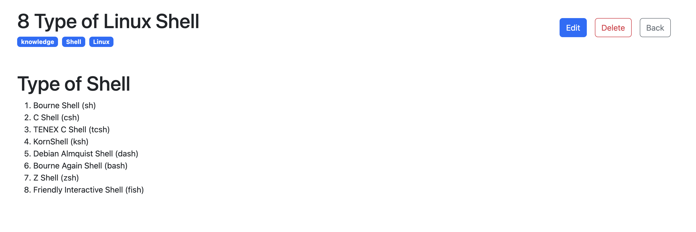

# Markdown-Blog

## About System

   This repo is about creating blogs with _**markdown**_ preview format.User can filter all blogs using filter values from input box and choosing available tags.Edit to the blogs are available for every blogs.

## Frameworks & Libraries Used

- [Vite](https://vitejs.dev/)
- [React](https://react.dev)
- [TypeScript](https://www.typescriptlang.org/)
- [React-Bootstrap](https://react-bootstrap.netlify.app/)

## Project Setup

clone or download

```
git clone https://github.com/thantwaisoe/markdown-blog.git
```

### Install Required Dependencies and Packages

```
npm i
```

### Compiles and hot-reloads for development

```
npm run dev
```

*****************

## Detail Implementation & Features of System

- When user created new blog, the system will save in browser's local storage with name **NOTES**, and getting back saved notes from this local storage

- In local storage, the system also store all the user created tag values with the name **TAGS**

- For UI implementation, most of Bootstrap components are used

- There is a transition effect on created notes cards from home page, which is made by traditional css

- User can filter blog from home page both from input box and selecting tags

- In edit tag modal, user can directly edit and delete unnecessary tags

- When creating new blog, user can select tags from existing or can create new tag for that blog

## Useful third-party libraries

### [React Markdown](https://github.com/remarkjs/react-markdown)

React component to render markdown.

### Usage in Project

In **_component/NoteDetail.tsx_**

```jsx
import { ReactMarkdown } from 'react-markdown/lib/react-markdown'
...
 <ReactMarkdown>
   {note.markdown}
</ReactMarkdown>
```

[Note preview](#note-preview) is created in this way.

******************

### [React Select](https://react-select.com/home)

A flexible and beautiful Select Input control for ReactJS with multiselect, autocomplete, async and creatable support.

### Usage in Project

In **_pages/NoteList.tsx_**

```tsx
import ReactSelect from 'react-select'

...

  <ReactSelect
       options={availableTags.map((tag) => ({
          label: tag.label,
          value: tag.id,
            }))}

```

_This component is used to select an existing tag value (used for filtering)._

In **_component/NoteForm.tsx_**

```tsx
import CreatableReactSelect from 'react-select/creatable'

...

 <CreatableReactSelect
    onCreateOption={(label) => {
       const newTag = { id: label }
       onAddTag(newTag)
       setSelectedTags((preprev, newTag])
    }}

```

_This component is used to create new tag value and user can select an existing tag value._

**************************

## Preview of System

### Home Page View


### Create New Note


### Note Preview

### mark-down format



### Edit Note


### Edit Tags


